# Шаблоны проектирования GoF

Так как многие шаблоны подразумевают использование принципов ООП, то код будет представлен на языке C#

## Порождающие шаблоны

### Фабричный метод

> Паттерн Фабричный Метод определяет интерфейс создания объекта, но позволяет субклассам выбрать класс создаваемого экземпляра. Таким образом, Фабричный метод делегирует операцию создания экземпляра субклассам.

В приложении предполагается интеграция различных сервисов с одинаковым ключевым функционалом (например, GitHub/GitLab), поэтому создадим интерфейс, который определяет создание объекта взаимодействия с хостингом репозиториев Git, а само создание реализовано в конкретных сервисах.

#### UML диаграмма

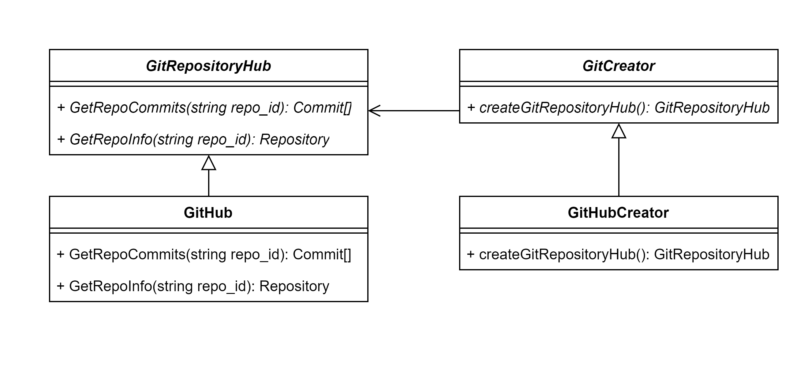

#### Реализация

Класс взаимодействия с хостингом репозиториев GitRepositoryHub:

    public abstract class GitRepositoryHub {

        public abstract Commit[] GetRepoCommits(string repo_id);
        public abstract Repository GetRepoInfo(string repo_id);
        // ...
    }

Класс создания объекта взаимодействия с хостингом репозиториев:

    public abstract class GitCreator {

        public abstract GitRepositoryHub createGitRepositoryHub();
    }

Теперь для добавления новой интеграции сервиса достаточно реализовать эти классы:

    public class GitHub : GitRepositoryHub {
        public override Commit[] GetRepoCommits(string repo_id) {
            // Получение через GitHub API ...
        }
        public override Repository GetRepoInfo(string repo_id) {
            // Получение через GitHub API ...
        }
    }

    public class GitHubCreator : GitCreator {
        public override GitRepositoryHub createGitRepositoryHub () {
            return new GitHub();
        }
    }

В коде:

    //...
        
        GitCreator githubCreator = new GitHubCreator();
        GitHub github = githubCreator.createGitRepositoryHub();
        var commits = github.GetRepoCommits(string repo_id);
        
    //...

### Абстрактная фабрика

> Паттерн Абстрактная Фабрика предоставляет интерфейс создания семейств взаимосвязанных или взаимозависимых объектов без указания их конкретных классов.

Курсовые работы могут быть проектными и исследовательскими и отличаются по содержвнию. Из-за этого у них отличаются и отчеты. Чтобы удовлетворить оба вида создадим абстрактную фабрику, которая создает абстрактную курсовую работу и отчет.

#### UML диаграмма

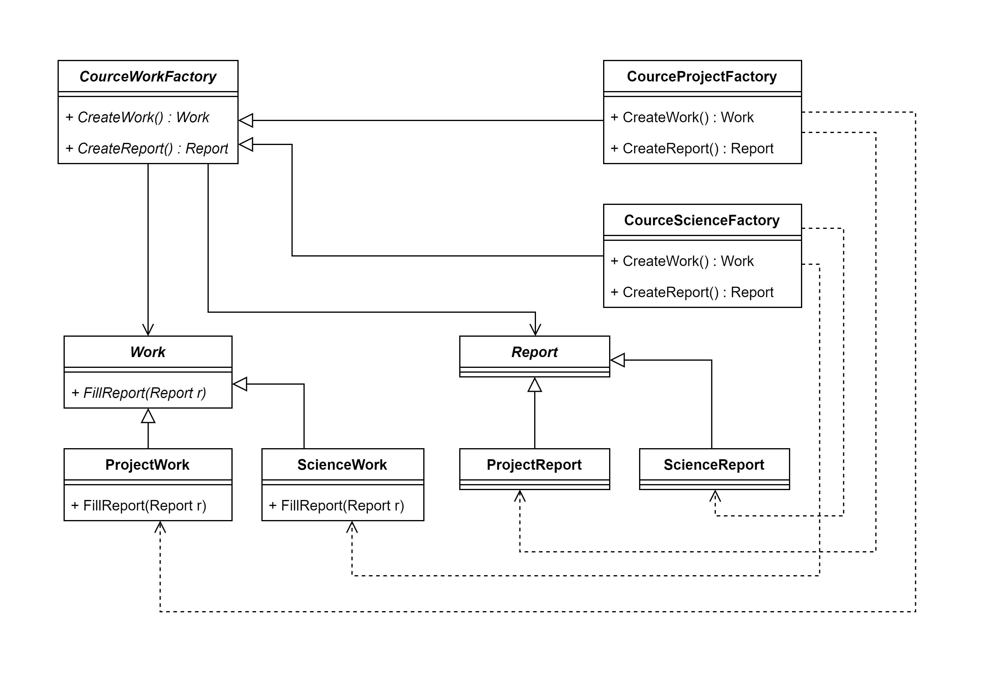

#### Реализация

Классы курсовой работы и отчета:

    public abstract class Report {

        // ...
    }

    public abstract class Work {

        // ...
        public abstract void FillReport(Report r);
    }

Класс абстрактной фабрики:

    public abstract class CourceWorkFactory {
        public abstract Work CreateWork();
        public abstract Report CreateReport();
    }

Реализация для проектной работы:

    public class ProjectReport : Report {

        // ...
    }

    public class ProjectWork : Work {

        // ...
        public override void FillReport(Report r){
            // заполнение отчета ...
        }
    }

    public class CourceProjectFactory : CourceWorkFactory {

        public override Work CreateWork(){
            return new ProjectWork();
        }
        
        public override Report CreateReport(){
            return new ProjectReport();
        }
    }
   

Реализация для исследовательской работы:

    public class ScienceReport : Report {

        // ...
    }

    public class ScienceWork : Work {

        // ...
        public override void FillReport(Report r){
            // заполнение отчета ...
        }
    }

    public class  : CourceWorkFactory {

        public override Work CreateWork(){
            return new ScienceWork();
        }
        
        public override Report CreateReport(){
            return new ScienceReport();
        }
    } 

В коде:

    // среда взаимодействия работы и отчета

    class Client
    {
        private Work _work;
        private Report _report;
    
        public Client(CourceWorkFactory factory)
        {
            _work = factory.CreateWork();
            _report = factory.CreateReport();
        }
    
        public void Run()
        {
            _work.FillReport(_report);
        }
    }
    
    // ...

    CourceWorkFactory pFactory = new CourceProjectFactory();
    Client clientP = new Client(pFactory);
    clientP.Run();

    // ...

    CourceWorkFactory sFactory = new CourceScienceFactory();
    Client clientS = new Client(sFactory);
    clientS.Run();

    // ...

### Синглтон

> Порождающий шаблон проектирования, гарантирующий, что в однопоточном приложении будет единственный экземпляр некоторого класса, и предоставляющий глобальную точку доступа к этому экземпляру.

В приложении существует класс StudentsProjectsManagementApp, в котором объявлены объекты для работы с бизнес-логикой. Так как они нужны повсеместно то создается синглтон с реализацией этих объектов.

#### UML диаграмма

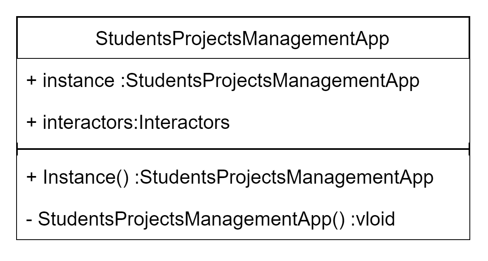

#### Реализация

    public sealed class StudentsProjectsManagementApp
    {
        private static readonly Lazy<StudentsProjectsManagementApp> instanceHolder =
            new Lazy<StudentsProjectsManagementApp>(() => new StudentsProjectsManagementApp());

        private StudentsProjectsManagementApp()
        {
            ...
        }

        public static StudentsProjectsManagementApp Instance
        {
            get { return instanceHolder.Value; }
        }

        public interactors Interactors; // набор объектов для работы с бизнес-логикой
    }

## Структурные шаблоны

### Фасад

> Шаблон Фасад объединяет группу объектов в рамках одного специализированного интерфейса и переадресует вызовы его методов к этим объектам.

В приложении есть классы, реализующую бизнес-логику. Для этого требуется использовать множество подсистем, таких как доступ к БД, интеграции. Один из классов бизнес-локиги ProjectInteractor содержит Use-Case функции, которые вызывают методы из различных подсистем, таким образом он является фасадом. 

#### UML диаграмма

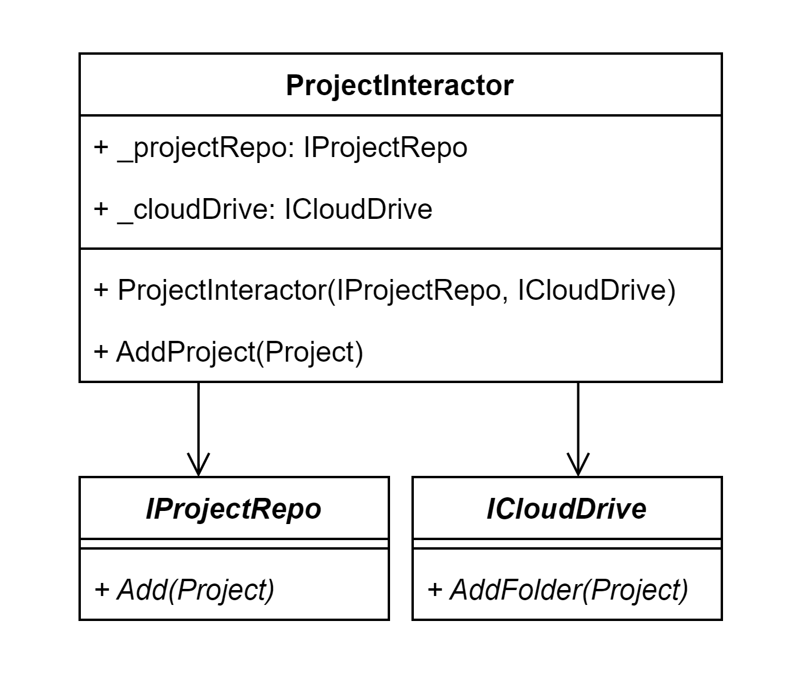

#### Реализация

Интерфейсы подсистем:

    public interface IProjectRepo{
        public void Add(Project p);
    }

    public interface ICloudDrive{
        public void AddFolder(Project p);
    }

Класс-фасад бизнес-логики с интерфейсами подсистем:

    public class ProjectInteractor{
        private IProjectRepo _projectRepo;
        private ICloudDrive _cloudDrive;

        public ProjectInteractor(IProjectRepo pr, ICloudDrive cd){
            _projectRepo = pr;
            _cloudDrive = cd;
        }

        public void AddProject(Project p){
            _projectRepo.Add(p)
            _cloudDrive.AddFolder(p)
            // ...
        };

        //...
    }

### Адаптер

> Преобразует интерфейс одного класса в интерфейс другого, который ожидают клиенты. Адаптер делает возможной совместную работу классов с несовместимыми интерфейсами.

Так как в приложении присутствуют интеграции, то в какой-то момент времени требуется вызывать методы API сторонних сервисов (например GitHub). Однако интерфейсы GitHub требуют и отдают входные выходные данные, которые не соответствуют ожиданиям клиентов. Для этого создается адаптер, который вызывает методы GitHub и преобразовывает данные для клиента.

#### UML диаграмма

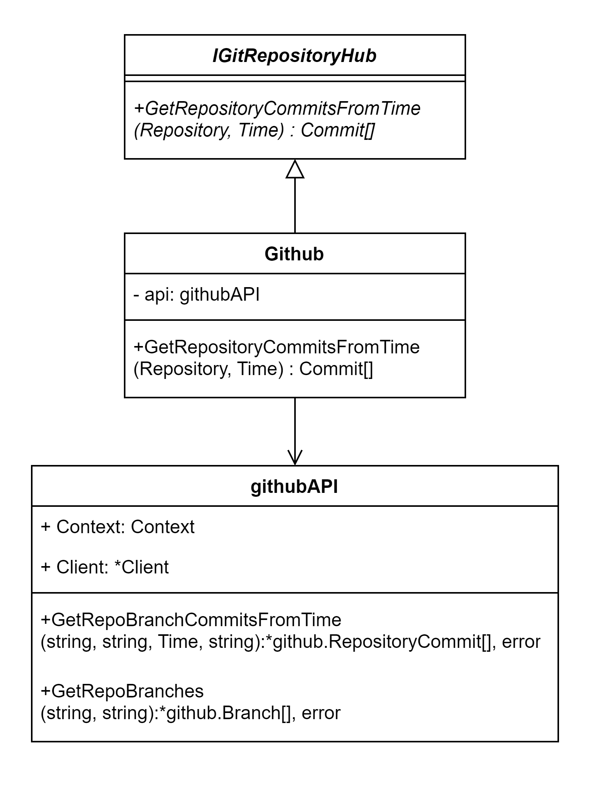

#### Реализация
Данная реализация уже существует в реализации проекта на Go, поэтому в этой секции будет использован он.

Класс (структура) обращения к GitHub API:

    package github

    import (
        "context"
        "time"

        "github.com/google/go-github/v56/github"
    )

    const AUTH_TOKEN = "..."

    type githubAPI struct {
        Context context.Context
        Client  *github.Client
    }

    func InitGithubAPI() githubAPI {
        context := context.Background()
        client := github.NewClient(nil).WithAuthToken(AUTH_TOKEN)

        return githubAPI{Context: context, Client: client}
    }

    func (g *githubAPI) GetRepoBranchCommitsFromTime(owner, repoName string, fromTime time.Time, branch string) ([]*github.RepositoryCommit, error) {
        opt := &github.CommitsListOptions{SHA: branch, Since: fromTime}
        commits, _, err := g.Client.Repositories.ListCommits(g.Context, owner, repoName, opt)
        if err == nil {
            return commits, nil
        }
        return nil, err
    }
    
    func (g *githubAPI) GetRepoBranches(owner, repoName string) ([]*github.Branch, error) {
        opt := &github.BranchListOptions{}
        branches, _, err := g.Client.Repositories.ListBranches(g.Context, owner, repoName, opt)
        if err == nil {
            return branches, nil
        }
        return nil, err
    }

Интерфейс адаптера:

    package interfaces

    import (
        "mvp-2-spms/services/models"
        "time"
    )

    type IGitRepositoryHub interface {
        GetRepositoryCommitsFromTime(repo models.Repository, fromTime time.Time) []models.Commit
    }

Реализация адаптера:

    package github

    import (
        "log"
        "time"

        "mvp-2-spms/services/models"

        "github.com/google/go-github/v56/github"
    )

    type Github struct {
        api githubAPI
    }

    func InitGithub(api githubAPI) Github {
        return Github{api: api}
    }

    func (g *Github) GetRepositoryCommitsFromTime(repo models.Repository, fromTime time.Time) []models.Commit {
        // to get all commits we need to check all the branches
        ghbranches, err := g.api.GetRepoBranches(repo.OwnerName, repo.RepoId)
        if err != nil {
            log.Fatal(err)
        }

        // finding all branches commits
        ghAllBranchesCommits := []*github.RepositoryCommit{}
        for _, branch := range ghbranches {
            ghbrcommits, err := g.api.GetRepoBranchCommitsFromTime(repo.OwnerName, repo.RepoId, fromTime, *branch.Name)
            if err != nil {
                log.Fatal(err)
            }
            ghAllBranchesCommits = append(ghAllBranchesCommits, ghbrcommits...)
        }

        // throwing away repeated commits (brnches might have the same history)
        ghCommitsUnique := map[string]*github.RepositoryCommit{}
        for _, c := range ghAllBranchesCommits {
            ghCommitsUnique[*c.SHA] = c
        }

        // transforming to entity
        commits := []models.Commit{}
        for _, ghcommit := range ghCommitsUnique {
            cm := mapCommitToEntity(*ghcommit)
            commits = append(commits, cm)
        }
        return commits
    }

    func mapCommitToEntity(commit github.RepositoryCommit) models.Commit {
        return models.Commit{
            SHA:         *commit.SHA,
            Description: *commit.Commit.Message,
            Date:        commit.Commit.Committer.Date.Time,
            Author:      *commit.Commit.Committer.Name,
        }
    }

### Мост

> Структурный шаблон проектирования, который позволяет отделить абстракцию от реализации таким образом, чтобы и абстракцию, и реализацию можно было изменять независимо друг от друга.

Классы бизнес-логики, как было сказано ранее, используют множество подсистем. Однако они будут зависеть от реализации этих подсистем. Для того, чтобы отделить их друг от друга используются мосты - интерфейсы, которые подсистемы должны реализовывать, и которые используют классы бизнес-логики.

#### UML диаграмма

#### Реализация

Подсистемы:

    public interface ProjectRepo{
        // ...

        public void Add(Project p){
            // ...
        }
    }

    public interface CloudDrive{
        // ...

        public void AddFolder(Project p){
            // ...
        }
    }

Интерфейсы подсистем - мосты:

    public interface IProjectRepo{
        public void Add(Project p);
    }

    public interface ICloudDrive{
        public void AddFolder(Project p);
    }

Класс бизнес-логики с интерфейсами подсистем:

    public class ProjectInteractor{
        private IProjectRepo _projectRepo;
        private ICloudDrive _cloudDrive;

        public ProjectInteractor(IProjectRepo pr, ICloudDrive cd){
            _projectRepo = pr;
            _cloudDrive = cd;
        }

        public void AddProject(Project p){
            _projectRepo.Add(p)
            _cloudDrive.AddFolder(p)
            // ...
        };

        //...
    }

### Заместитель

> Этот паттерн помогает решить проблемы, связанные с контролируемым доступом к объекту. 

При использовании приложения пользователи будут обращаться к сервису для получения данных. Однако некоторые данные не меняются часто (например, коммиты студента в репозиторий), и чтобы на сервер не приходило множество запросов, создается класс-прокси, который кэширует данные и обновляет их по необходимости, создавая иллюзию запроса к серверу.

#### UML диаграмма

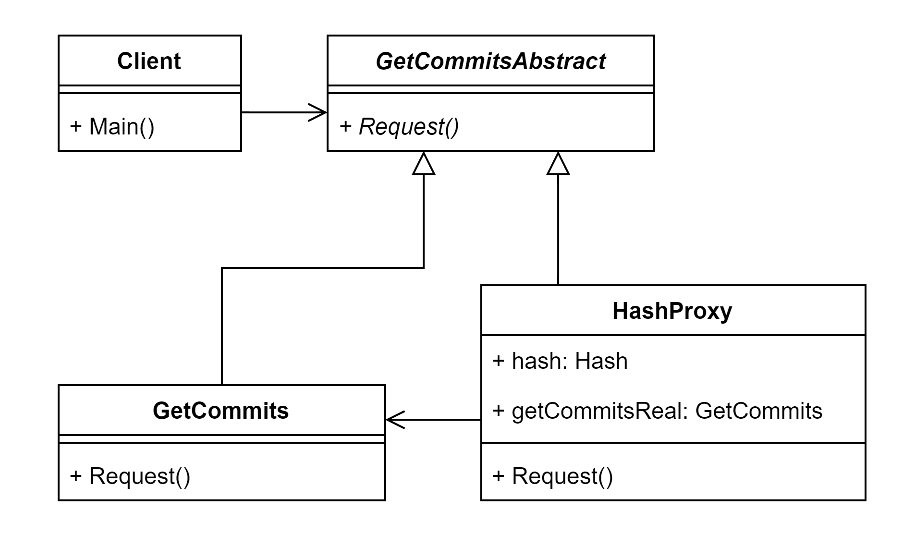

#### Реализация

    class Client
    {
        void Main()
        {
            Subject subject = new HashProxy();
            subject.Request();
        }
    }
    abstract class GetCommitsAbstract
    {
        public abstract void Request();
    }
    
    class GetCommits : GetCommitsAbstract
    {
        public override void Request()
        {}
    }
    class HashProxy : GetCommitsAbstract
    {
        GetCommits getCommitsReal;
        Hash hash;

        public override void Request()
        {
            if (realSubject == null)
                realSubject = new RealSubject();
            if !CheckHashExpire(hash)
                realSubject.Request();
            hash.request();
        }
    }

## Поведенческие шаблоны

### Стратегия

> Определяет семейство алгоритмов, инкапсулирует каждый из них и делает их взаимозаменяемыми. Стратегия позволяет изменять алгоритмы независимо от клиентов, которые ими пользуются.

В приложении, как уже говорилось, используются интеграции, и планируется предоставить пользователю выбор определенного сервиса для каждой интеграции (GitHub/ GitLab). Для этого выделим класс-стратегию, которая будет описывать алгоритм взаимодействия с хостингом репозиториев Git, а реализацию перенесем в классы GitHub и GitLab.

#### UML диаграмма

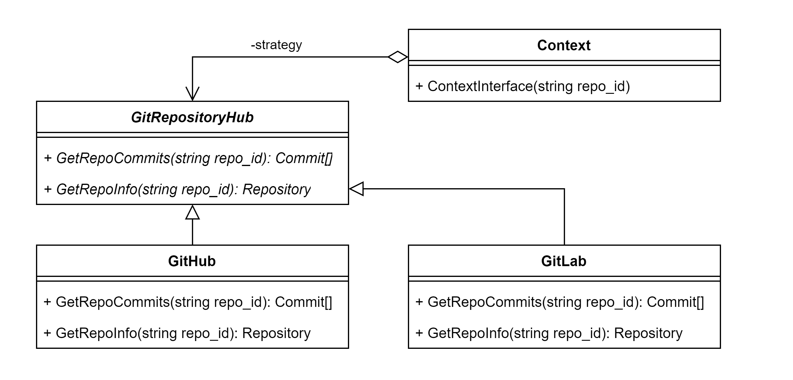

#### Реализация

Класс-стратегия взаимодействия с хостингом репозиториев GitRepositoryHub:

    public abstract class GitRepositoryHub {

        public abstract Commit[] GetRepoCommits(string repo_id);
        public abstract Repository GetRepoInfo(string repo_id);
        // ...
    }

Реализации стратегии:

    public class GitHub : GitRepositoryHub {
        public override Commit[] GetRepoCommits(string repo_id) {
            // Получение через GitHub API ...
        }
        public override Repository GetRepoInfo(string repo_id) {
            // Получение через GitHub API ...
        }
    }

    public class GitLab : GitRepositoryHub {
        public override Commit[] GetRepoCommits(string repo_id) {
            // Получение через GitLab API ...
        }
        public override Repository GetRepoInfo(string repo_id) {
            // Получение через GitLab API ...
        }
    }

В коде:

    //...

    public class Context {
        private readonly GitRepositoryHub _strategy;

        // Constructor
        public Context(GitRepositoryHub strategy)
        {
            _strategy = strategy;
        }

        public void ContextInterface(string repo_id)
        {
           var commits = _strategy.GetRepoCommits(repo_id);
           
           // ...
        }
    }

    //...

### Итератор

> Представляет доступ ко всем элементам составного объекта, не раскрывая его внутреннего представления.

В приложении данный шаблон можно использовать для итерирования таких сущностей как задания проекта. 

#### UML диаграмма

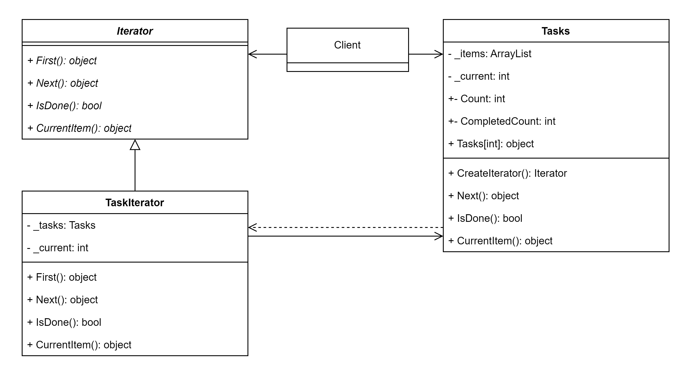

#### Реализация

Итерируемый класс 

    class Tasks 
    {
        private ArrayList _items = new ArrayList();
 
        public Iterator CreateIterator()
        {
            return new TaskIterator(this);
        }
 
        public int Count
        {
            get { return _items.Count; }
        }
 
        public object this[int index]
        {
            get { return _items[index]; }
            set { _items.Insert(index, value); }
        }

        // подсчет выполненных заданий
        public int CompletedCount {
            get { return _items.CountCompleted;}
        }
    }

Абстрактный итератор и его реализация.

    abstract class Iterator
    {
        public abstract object First();
        public abstract object Next();
        public abstract bool IsDone();
        public abstract object CurrentItem();
    }
 
    class TaskIterator : Iterator
    {
        private Tasks _tasks;
        private int _current = 0;
 
        public TaskIterator(Tasks tasks)
        {
            this._tasks = tasks;
        }
 
        public override object First()
        {
            return _tasks[0];
        }
 
        public override object Next()
        {
            object ret = null;
            if (_current < _tasks.Count - 1)
            {
                ret = _tasks[++_current];
            }
 
            return ret;
        }
 
        public override object CurrentItem()
        {
            return _tasks[_current];
        }
 
        public override bool IsDone()
        {
            return _current >= _tasks.Count;
        }
    }

Перебор заданий:

    // ...

    Tasks t = new Tasks();
    t[0] = new Task("1");
    t[1] = new Task("2");

    TaskIterator i = t.CreateIterator();

    object item = i.First();
        while (item != null)
        {
            // работа с заданием
            item = i.Next();
        }
    
    // ...

### Интерпретатор

> Для заданного языка определяет представление его грамматики, а также интерпретатор предложений этого языка.

В сущностях приложения существуют перечеслимые типы для статусов, стадии проектов, встреч, заданий. Они передаются в качестве строк с названием ("Not started", "In progress"). Однако пользователям будет удобно видеть русифицированную версию, для этого используется интерпретатор.

#### UML диаграмма

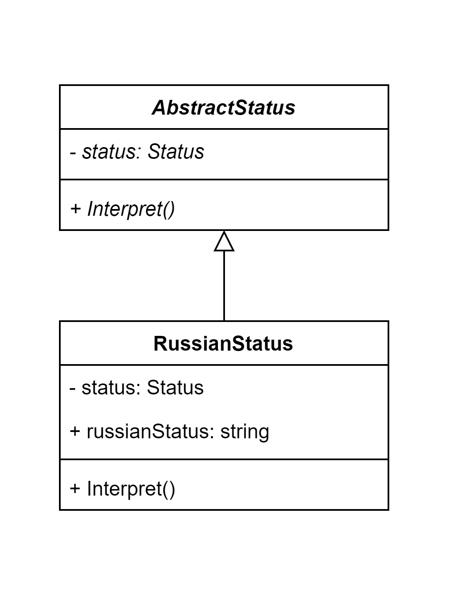

#### Реализация

    public abstract class  {
        private Status status;

        public AbstractStatus(Status status){
            this.status = status;
        }

        public abstract void Interpret();
    }

    public class RussianStatus : AbstractStaus {
        public string russianStatus;

        public RussianStatus(Status status){
            super(status);
        }

        public override void Interpret(){
            switch(this.status){
                case Status.NotStarted : {
                    this.russianStatus = "не начат"
                }
                break;
                case Status.InProgress : {
                    this.russianStatus = "в процессе"
                }
                break;
                default : {
                    this.russianStatus = "неизвестен"
                }
            }
        }
    }

### Наблюдатель 

> Назначение этого паттерна в том, чтобы определять зависимость типа «один ко многим» между объектами таким образом, что при изменении состояния одного объекта все зависящие от него оповещаются об этом и автоматически обновляются. 

В приложении пристутствуют сущности, атрибуты которых зависят от других, например проект содержит информацию о преподавателе, курирующем его. При реализации со специфичным хранилищем данных, которое не обновляет данные автоматически, как база данных, требуется наблюдатель, который сообщает всем проектам, что информация о преподавателе обновилась.

#### UML диаграмма

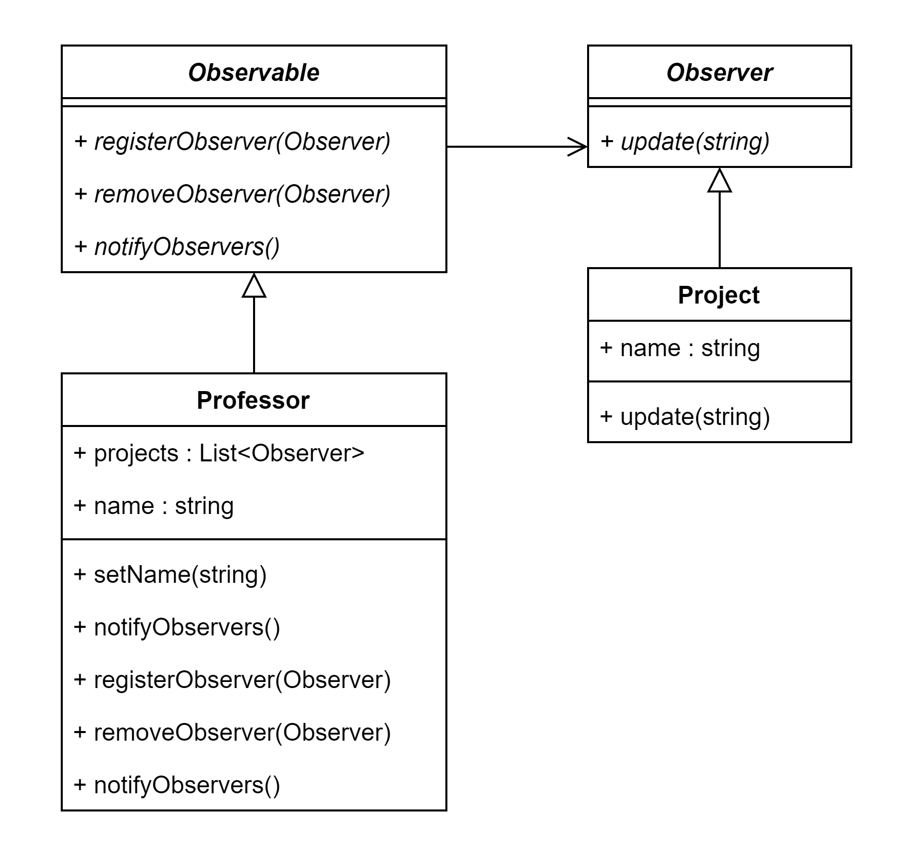

#### Реализация

Интерфейс вещателя новостей и его реализация у преподавателя:

    interface Observable {
        void registerObserver(Observer o);
        void removeObserver(Observer o);
        void notifyObservers();
    }

    public class Professor : Observable {
        private List<Observer> projects;
        private string name;

        public Professor(string name) {
            projects = new ArrayList<>();
            this.name = name;
        }

        public void setName(string name) {
            this.name = name;
            notifyObservers();
        }

        public override void registerObserver(Observer o) {
            projects.add(o);
        }

        public override void removeObserver(Observer o) {
            projects.remove(o);
        }

        public override void notifyObservers() {
            for (Observer o : projects)
                o.update(newsChurch);
        }
    }

Интерфейс наблюдателя и его реализация у проекта:

    interface Observer {
        void update (string news);
    }

    public class Project : Observer {
        private string name;

        public Project(string name, Observable o) {
            this.name = name;
            o.registerObserver(this);
        }

        public override void update(string news) {
            System.out.println(name + " узнал новость: " + news);
        }
    }

В коде:

    // ...

    Professor observable = new Professor("Настя");

    observable.registerObserver(new {Project}("123"));

    observable.setName("Анастасия");

    // ... 

### Шаблон

> Определяет общий алгоритм поведения подклассов, позволяя им переопределить отдельные шаги этого алгоритма без изменения его структуры.

Приложение предоставляет возможность уведомления преподавателей о предстоящих встречах. И преподаватель может выбрать способ получения этих уведомлений (в мессенджере, по почте, смс и т. д.). Чтобы не реализовывать один и тот же алгоритм уведомления для каждого варианта создается класс-шаблон, который описыывает общий алгорим, а сам способ отправки реализуют сервисы.

#### UML диаграмма

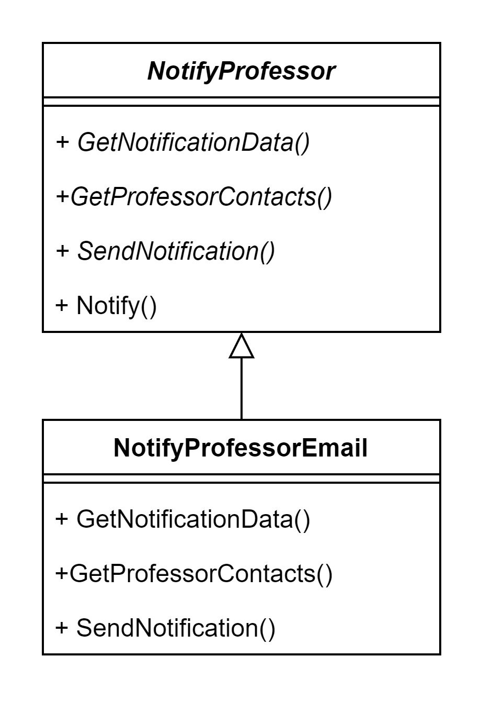

#### Реализация

Абстрактный класс уведомления преподавателя:

    public abstract class NotifyProfessor {
        public abstract void GetNotificationData();
        public abstract void GetProfessorContacts();
        public abstract void SendNotification();

        public void Notify(){
            GetNotificationData();
            GetProfessorContacts();
            SendNotification();
        }
    }

Реализации класса для почты:

    public class NotifyProfessorEmail : NotifyProfessor {
        public void GetNotificationData(){
            // получение содержания письма
        }
        
        public void GetProfessorContacts(){
            // получение информации о почте
        }

        public void SendNotification(){
            // отправка по почте
        }
    }